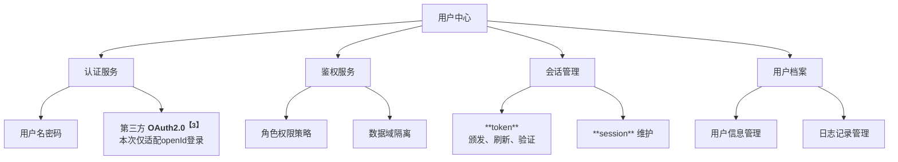
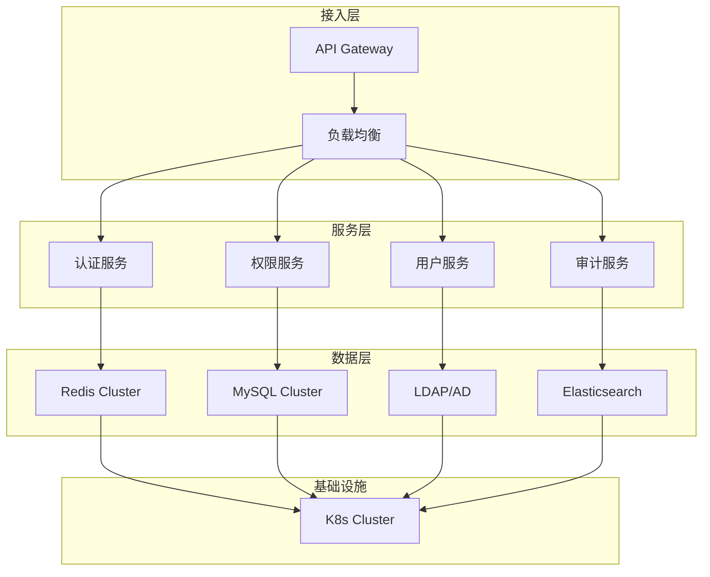
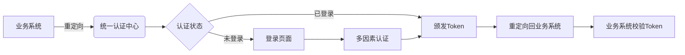

---
nav:
    title: 项目 🏭
    order: 3
title: 产品设计方案
order: 2
group:
    title: 🚪 登陆鉴权服务
    order: 2
---

# 🚪 通用登陆鉴权服务建设 <Badge type="warning">0.0.1</Badge> <Badge type="success">产品prd</Badge>

:::info{title="登陆鉴权服务"}
**登陆、鉴权** 是所有后端服务的基础，承载用户身份鉴别、权限隔离、越权判定等重要职能。

随着业务不断扩展，用户身份管理和权限隔离成为保障系统安全和业务合规的关键。本产品旨在打造一个通用的登陆鉴权服务，支持 **多应用接入**，提供统一的用户信息管理、权限隔离、认证鉴权的前后端能力，并具备高可用性、良好的可扩展性和易维护性。
:::

## 产品概述

**通用登录鉴权服务** 作为后端服务建设的基础能力，旨在为业务系统提供统一的用户身份认证、用户信息管理及权限控制功能，具备 🔐 安全、✅ 稳定、💎 高可用 能力；提供通用基础 **中间件SDK** 和 **前端调用** 能力，支持 **Web、移动端、小程序** 等多终端接入，适配 **B2C、B2B、SaaS** 等多种业务场景，有效解决分散鉴权带来的重复开发、权限混乱和安全风险等问题，降低业务系统接入成本，同时保障数据安全与访问合规。

### 1.1 项目背景

为了实现统一账号管理，避免各系统独立认证导致用户体验割裂、安全风险分散、运维成本攀升等问题，亟需统一、安全、可扩展的 **用户登录认证中心**。本项目拟实现以下功能：

- 🚪 **统一认证**：实现“一次登录，业务全通”。
- 📁 **权限管控**：支持 **RBAC**（Role-Based Access Control）模型【1】。
- 🔐 **数据安全**：满足 **GDPR**（General Data Protection Regulation）要求【2】。
- 💎 **高可用**：**99.99%** 可用性（TP95 < 150ms，TP99 < 300ms），前端调用不做要求（网卡较差），十万级QPS支撑。

### 1.2 核心能力

本产品提供统一 **身份认证、权限判定、会话管理、日志记录** 的能力，具体见下图：

### 1.3 核心目标

- **标准化收敛**： 统一认证授权流程，减少各业务线重复开发，提升研发效率。
- **提升安全能力**： 实施统一、高强度的安全策略，保障账户体系和数据安全。
- **优化用户体验**： 实现跨应用的单点登录（SSO），提升用户登录便捷性。
- **高可用与可扩展**： 设计高可用架构，支持水平扩展，能平稳应对业务峰值和未来用户量增长。
- **赋能业务分析**： 沉淀统一的用户ID体系，为精准营销、用户分析提供数据基础；支持灵活的权限模型，满足复杂业务场景的权限隔离需求。

## 竞对调研

目前大厂通用的权限管理方案同

| 调研维度 | 核心架构 | 权限模型 | 认证方式 | 安全设计 | 扩展性设计 |
| :--: | :-- | :-- | :-- | :-- | :-- |
| **美团闪购** （B 端 + 开放平台） | 统一账号体系支撑矩阵应用（闪购、外卖、优选等），采用 “平台 UserID + 应用 AppUserID” 双标识设计，实现账号数据跨应用同步但权限隔离 | 1. 授权等级分层（高 / 中 / 低），高等级包含低等级权限范围  2. 接口功能分类授权（门店 / 订单 / 药品等）  3. 主账号 - 子账号角色分配，支持功能边界精细化划分 | 1. 商家自授权基于 OAuth2.0 协议，通过 access_token 实现时效性授权  2. 子账号登录需二次验证（短信 / 邮箱）  3. 支持门店绑定授权工具可视化操作 | 1. access_token 时效性控制，避免永久授权风险  2. 子账号绑定设备指纹，设定有效期  3. 关键操作留痕审计，支持合规审查 | 1. 支持 ISV 应用接入，授权范围可灵活配置  2. 接口分类模块化，便于新增业务授权维度 |
| **阿里巴巴** （阿里云 + 企业级） | 云 SSO+RAM 访问控制双核心，基于 SAML 2.0 协议实现企业 IdP 与云服务 SP 的身份联合，支持多账号集中管控 | 1. 最小权限原则，支持资源对象级、API 操作级细粒度授权  2. 用户组批量授权，权限与身份分离  3. RAM 角色机制支持跨账号 / 第三方协作授权 | 1. 支持 SAML 2.0 单点登录，禁用账号密码登录  2. 多因素认证（MFA / 通行密钥）  3. STS 临时凭证机制，替代长期 AccessKey | 1. 零信任架构，动态权限验证  2. 证书定期轮转（支持新旧证书平滑切换）  3. 操作日志全链路追溯，审计日志不可篡改 | 1. 支持 SCIM 协议同步企业用户  2. 资源目录 + 云 SSO 适配多业务账号隔离  3. 可信 CA 证书与自签名证书灵活切换 |
| **抖音** （C 端 + 多端场景） | 单账号多端登录体系，独立设备管理模块，支持跨端会话可视化与精准管控 | 1. 基于设备维度的权限管控，支持单设备下线 / 批量会话终止  2. 第三方授权独立管理，需在对应平台单独解除关联 | 1. 手机号 + 验证码 / 密码 / 第三方快捷登录  2. 密码修改触发全量会话失效  3. 更换绑定手机号间接清空设备关联 | 1. 登录设备可视化管理，异常设备快速下线  2. 密码强度强制要求（8 位 + 字母数字组合）  3. 第三方授权独立隔离，避免权限扩散 | 1. 多端登录状态独立管理，支持跨设备操作同步  2. 设备解绑方式多样化（直接下线 / 改密 / 换绑手机号） |

### 2.1 MEITUAN-SHANGOU
美团闪购后台

### 2.2 ALIBABA
阿里巴巴

### 2.3 DOUYIN
抖音

## 方案设计

基于 **「高内聚、低耦合」** 的架构思想，便于后续其余系统能够使用底层基础能力，将涉及的服务拆分成 **用户中心**、**日志中心**【4】两个底层能力模块；本期重点放在 **用户中心** 底层服务能力的建设上，主要提供用户 **身份认证、权限判定、会话管理** 等功能。日志记录会依赖日志中心提供的基础底层能力，对 **注册账号、重置密码、注销登陆、变更权限** 等重要操作节点日志进行写入记录，便于问题定位和回溯排查。

### 3.1 功能模块

用户中心的功能主要包含：**SSO登陆、MFA认证、会话管理、权限管理** 等模块。具体详细描述如下：

**单点登录（SSO）**
> 以 **OAuth 2.0/OpenID Connect** 协议为基础，集成 **JWT Token** 格式进行身份认证和授权。

- 支持 **OAuth 2.0/OpenID Connect** 协议
- **JWT Token** 格式：**Header.Payload.Signature**
- **Token** 有效期：**Access Token** 2小时，**Refresh Token** 30天

**多因素认证（MFA）**
- 基础层：用户名+密码（**PBKDF2** 加密）
- 增强层：邮箱验证码/TOTP动态令牌（登陆、密码重置等）
- 策略配置：按风险等级动态触发（新设备登录、敏感操作等）（暂保留设计，本期不实现）

**会话管理**
- 全局会话ID（**SSO Session ID**）
- 会话超时：**30分钟** 无操作自动失效
- 实时会话监控：管理员可 **强制下线** 异常会话 （暂保留设计，本期不实现）

**权限判定**
- 角色权限策略
- 黑名单机制（角色继承权限对某个账号不可见）

### 3.2 架构设计

### 3.3 整体流程

### 3.4 开放SDK/外部系统调用

## 后期建设

---

> ## 注释
> 
>【**1**】：**RBAC (Role-Based Access Control)**，核心逻辑为 **权限绑定角色**，用户通过角色继承权限。适用于组织架构清晰的系统，但对于复杂结构可能存在角色爆炸问题，缺乏细粒度控制。由此对应的模型为 **ABAC (Attribute-Based Access Control)**，核心逻辑为 **权限由属性动态计算生成**，适用于需要细粒度控制的复杂场景；该模型缺点在于策略配置复杂，计算开销大。
> 
>【**2**】：**GDPR（General Data Protection Regulation）**，即欧盟《通用数据保护条例》，是全球最严格的个人数据保护法规之一，数据处理具备以下七个原则：**合法、正当、透明**、**目的限制**、**数据最小化**、**准确性**、**存储限制**、**完整性与保密性**、**问责制**。
> 
>【**3**】：**OAuth2.0（Open Authorization 2.0）**，是一个授权框架，允许用户授权第三方应用访问其在某个服务商（如微信、Google）的部分资源，而无需将密码直接提供给第三方。
>
>【**4**】：考虑后续的业务可能会接入日志系统，因此将 **日志中心** 能力单独拆分出来，作为底层基础能力进行建设。本方案仅使用到日志记录能力，该模块具体详情详见 [日志中心prd](../program/log-prd) 和 [日志中心技术方案](../program/log-back-tp)。

