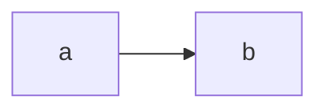

本项目拟基于 `微信小程序` 进行开发，使用原生框架进行代码编写，三方组件使用 `Vant/weapp`，后端部分采用微信的云开发，语言为 `NodeJs`，数据苦使用 `Mysql`，

```mermaid
graph LR
a --> b
```

#### 1.1 技术栈

#### 1.2 技术架构

#### 1.3 前端方案设计

#### 1.4 后端方案设计

#### 1.5 库表设计

end
