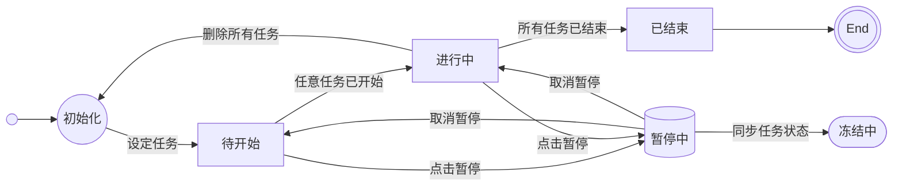
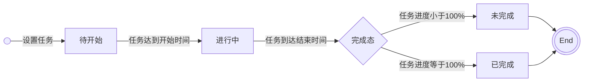
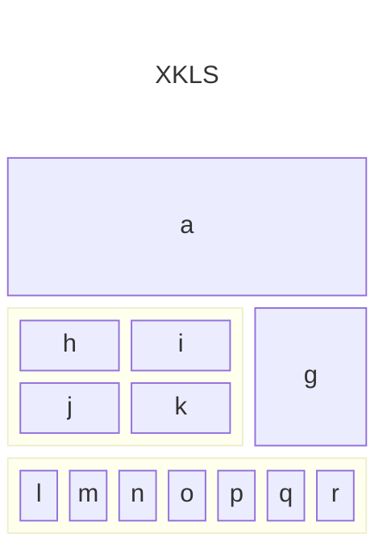
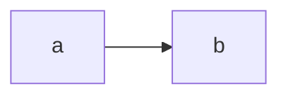

## 🤖️ Connor <Badge>终结者</Badge> <Badge type="warning">0.0.1</Badge> <Badge type="success">立项/KickOff</Badge>

:::info{title="什么是CONNOR？"}
**Connor**，中文名：**终结者**。

取名寓意来自电影《**Terminator**》，电影中人工智能天网要消灭全人类，而女主 **莎拉・康纳**（**Sarah Connor**）是未来反抗军领袖 **约翰・康纳** 的母亲，因此她成为了终结者追杀的关键目标。如果 **莎拉・康纳** 被消灭，**约翰・康纳** 就不会出生，人类反抗军也就失去了最重要的领袖。

因此对于 **Connor** 来说，时间的每一份每一秒都很宝贵。本项目也希望借助 **APP** 帮助我们更加高效利用时间，最终逃出 **终结者** 的追捕，实现命运的逆转！
:::

### 1. 产品架构

本产品的终极目的是帮助用户更加高效 制定计划、管理目标、掌控时间，在综合考察目前市场已有的竞品（`Vis`, `目标地图`）等，发现普遍存在共性的使用痛点，列举如下。

| 产品 | 平台 | 版本 | 设计 | 痛点 |
| :--: | :--: | :--: | :--: | :-- |
| **Vis** | app / ios | 4.1.4 | `目标节点`-`目标`-`关键结果` | 1. 目标、里程碑、任务 维度数据组织不合理   2. 量化任务进度逻辑复杂，使用体感上过于抽象   3. 没有用户操作介入和及时通知，平时基本无感   4. 不符合日常使用中需要临时推迟某一任务的使用需求 |
| **目标地图** | app / ios | 3.12.2 | `制定目标`-`拆解`-`执行`-`复盘` | 1. 基本同上   2. 复盘功能鸡肋，更应该改成多维度的报告呈现给用户   3. 统计展示维度过于简单，没有对于计划的深入分析数据展示   |

根据以上的 **APP** 调研分析，目前产品形态上设计通病在于 **形而上思想**，没有触及需要使用产品用户的真实诉求（`更直观`、`更简单`、`更智能`、`更人性`），大量的用户痛点视而不见；需要在产品内部实现的逻辑下放给用户（`个人复盘`、`进度计算逻辑`、 `整体规划` 等），在使用整体体验上就会存在 难用、搞不懂、目标制定后一年半载才想起来看看 等情况。整体来看，现在的同类产品定位上更像是一款 *精致的个人手帐日志* 而非 专注于目标实现。

#### 1.1 痛点剖析

- 产品架构设计复杂：目前市面上几乎所有的目标管理产品都是基于 **目标**、**里程碑** 和 **任务** 维度进行组织管理，这在设计上很理想也很简洁，但是这样的产品架构设计和实际应用场景上存在较多冲突。从理论上看，用户在设定目标的时候通常是基于实现或达成某种特定目的，但是这个目标通常不易达成，也不易细化。因此，由 `目标` ➡️ `里程碑` ⬅️ `任务` 的设定模式会要求用户前置化已经对目标完成有清晰的规划和认知。从用户角度来看，好的设计应该是降低理解成本，帮助用户更好拆解目标值，更加高效达成目标。在产品使用方面上，市面已有的竞品中上述三个维度（目标、里程碑、任务）的数据通常是独立存在，这无形中是在增加用户心智成本，造成用户只是针对产品设置的卡点填入数据，而非聚焦于真实希望达成的目的。此外，这三个维度的数据状态管理和扭转关系设计不符合常识。**目标** 通常更类似概念一样的虚体，而 **任务** 需要落实到具体的行动实体，**里程碑** 则是对一组相关的 **任务** 是否完成的度量；基于现实体验上来看，目标下的任务通常是变化更新的，而 **任务** 通常是跨天的，因此整体目标的状态应当基于最小维度- **当日任务** 进行自动计算更新。

- 目标录入规则不合理：**目标**、**里程碑** 和 **任务** 从来不是割裂的维度，上面分析到 **目标** 和 **里程碑** 的状态其实都是依赖于 **任务** 的设置，考虑到用户在实际需求中思维活动路径是先想要完成某一个特定的目标，然后借助产品细化目标任务，达成高效完成的目的。为了更贴合用户实际思考习惯和思维路径，**目标** 不应当设置具体的启止时间，而是根据 **任务** 进行自动计算。**目标** 下面应该包含具体的多项 **任务**，而 **任务** 又可被拆分到每天的完成部分，即 最小录入单元。时间维度上最小录入单元为 **小时**，这也是大多数用户保持专注的时间极限。因此这个有机的整体从小至大划分为 `每日任务（小时维度）` ➡️ `任务` ➡️ `里程碑（一组任务的集合）` ➡️ `目标`。在实际设计中还应考虑到日常适用上的已有条件，比如一天是时间是有限的，因此对于每日任务数量其实是有上限要求。
  
- 目标完成计算逻辑复杂：市面上所有竞品的任务计算逻辑都设计的非常反直觉，并且具体的计算和规划步骤都转接给用户，这不仅难以理解，并且在很大程度上降低用户使用体验。仔细分析一下计算逻辑我们发现，其核心是在度量任务、目标的完成进度。量化任务进度比较复杂，但是我们仍然可以施展转化大法（即将 **计算逻辑** 转化为 **用户动作**）。通过拆解任务到 `天-时` 的维度，增加 `执行/结束` 的用户操作，收集必要的核心计算数据，通过内置的计算内核根据收集的信息自动实时计算进度（当然这也在另一个方面要求产品设置尽可能细化的卡点，收集尽可能多的用户动作，以使得计算数据和实际更为接近）。

- 任务进行过程用户无感知：**Vis**、**目标地图** 等产品的功能在 **执行阶段** 的存在感非常薄弱。用户在花费大量心力设定好目标和任务等初始化数据后，执行期间却少有相关感知和操作动作，这就造成用户的习惯性忘记，如果一个目标设定在较后的时间开始，很有可能直到设定的期限过去用户都未真正开始，这不仅有悖于产品设计理念，在事实上也没有起到目标管理的效果。从用户心理分析，大多数用户使用相关产品的目的是 **精准的目标和任务管理、及时的通知及多维度进度可视化展示**。可见执行阶段也是产品设计、使用中重要的一环，但是目前的大部分同类竞品和类似产品在这部分都存在缺陷，例如 **Vis**、**目标地图** 等在执行阶段没有及时的消息提醒和有效管理，造成用户感知薄弱；**番茄时钟** 等产品重点放在用户行为管理上，但是对于执行的任务管理却依赖用户决策，这也在一定程度上加重了用户的负担，并且对于最终达成目标不存在明显提效。

#### 1.2 整体设计

**Connor** 整体设计上摒弃过重的逻辑抽象，更加贴近用户日常思维和操作习惯。我们将整个产品使用过程的生命周期抽象化为三个阶段：`立项阶段` ➡️ `执行阶段` ➡️ `复盘阶段`，以 **项目** 的维度进行整体运营。细化产品生命周期的用户行为，以 `用户动作` 来替换 `用户思考`，降低用户在使用过程中的心智负担。

> **生命周期**：`立项阶段` ➡️ `执行阶段` ➡️ `复盘阶段`
> 
> **设计思想**：以 `用户动作` 来替换 `用户思考`，以降低用户的心智负担
>
> **产品交互**：细化产品生命周期中用户动作，在 `执行阶段` 增加卡点、交互和反馈机制。

- **生命周期**：此处生命周期是指，用户在使用本产品时，从进入的 **初始态** 到完成的 **终态** 之间所有相关事物（产品形态和用户动作）集合。**Connor** 对此进行高度的抽象简化。

  - **立项**：是整个 **APP** 运行的入口和逻辑起始点，**Connor** 需要的所有初始化数据都来自这里；这些数据在时间、空间上联系紧密，因此参考项目管理中的概念将这所有动作抽象成一个集合 `立项`。`立项` 包含了 `录入目标`、`拆分任务`、`规划日程` 和 `划定里程碑` 等步骤。各步骤只设定自己运行中所需的必要数据，这样更贴近用户的思考，也不会造成各层级数据冗余。例如：`目标` 自身不再维护一个时间维度数据，应该由包含的所有 `任务` 起止时间计算得到；`里程碑` 由一组任务的完成状态的 **快照**，不应当单独作为一个维度的数据进行维护。
  
    |步骤|描述|属性|状态|状态流转|
    |--|--|--|--|--|
    |录入目标|**目标** 在业务中对应需实现的实体，在产品设计上对应一组任务的集合，是 **任务**、**里程碑** 等数据挂载对象。|名称、关联任务、关联里程碑、状态|`初始化`、`待开始`、`进行中`、`已结束`|[链接](./weapp-connor.md#131-目标状态流转关系)|
    |拆分任务|**任务** 是对目标的细致划分，具体到可以执行的 **动作**。任务可以跨天执行|名称、时间、关联日程、|`待开始`、`进行中`、`已完成`、`未完成`、`冻结中`|[链接](./weapp-connor.md#132-任务状态流转关系)|
    |规划日程|日程会根据时间自动划分到||`待开始`、`进行中`、`已结束`||
    |划定里程碑|||`未点亮`、`已达标`、`未达标`||

  - **执行**：执行阶段涉及最多的用户交互动作。 

  - **复盘**：由于前两个生命周期中，app收集到了较多的数据，因此

- **设计思想**：

- **交互设计**：

#### 1.3 状态机

##### 1.3.1 目标状态流转关系

##### 1.3.2 任务状态流转关系

##### 1.3.3 日程状态流转关系

#### 1.4 产品整体流程

#### 1.5 架构图

架构

#### 1.6 原型图

---
 
### 2. 技术路线

本项目拟基于 `微信小程序` 进行开发，使用原生框架进行代码编写，三方组件使用 `Vant/weapp`，后端部分采用微信的云开发，语言为 `NodeJs`，数据苦使用 `Mysql`，

#### 2.1 技术栈

#### 2.2 技术架构

#### 2.3 前端方案设计

#### 2.4 后端方案设计

#### 2.5 库表设计

### 3. 项目管理

<code id="test1">

<code>